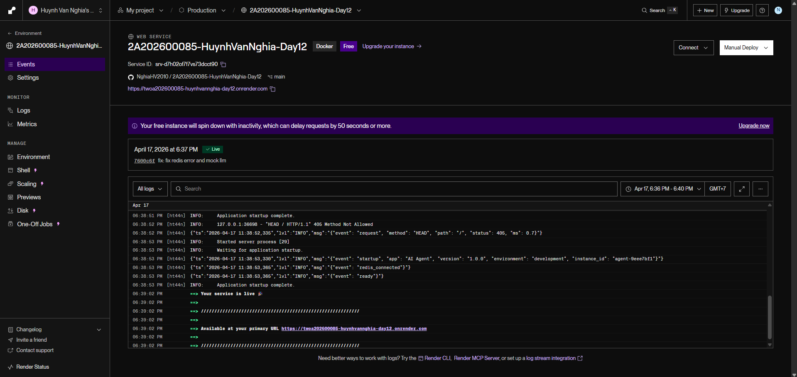
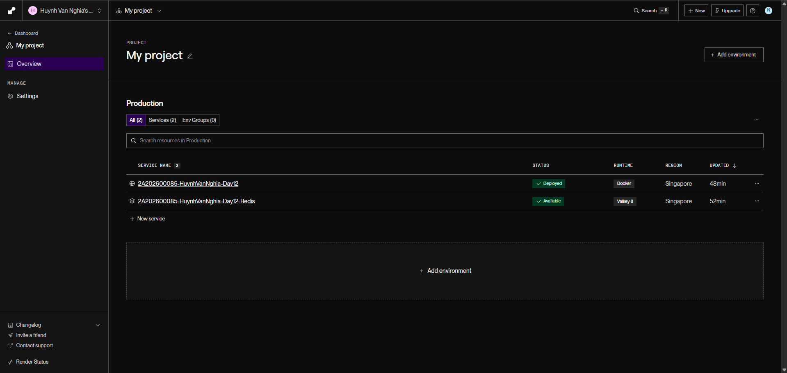
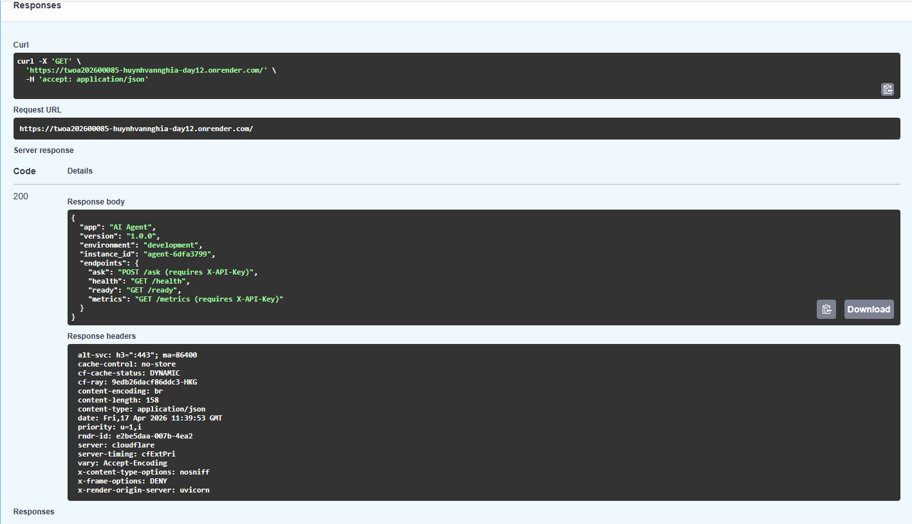
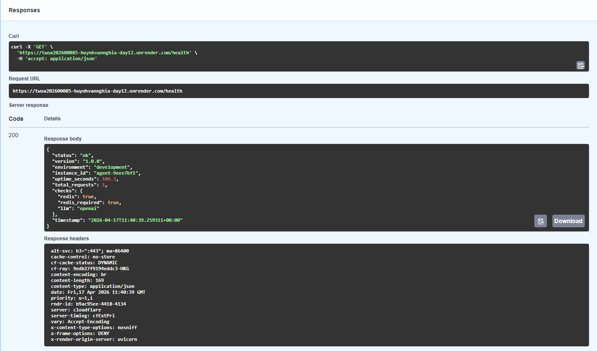
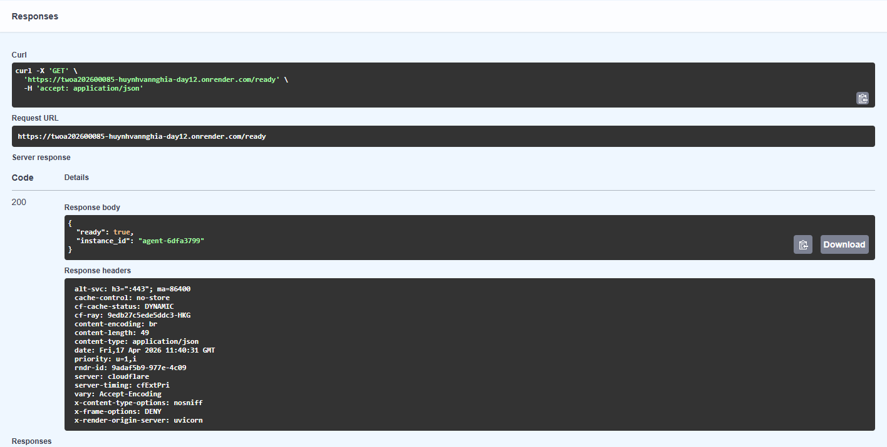
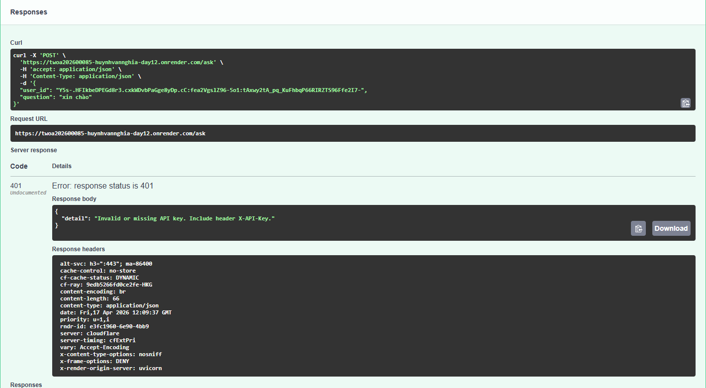
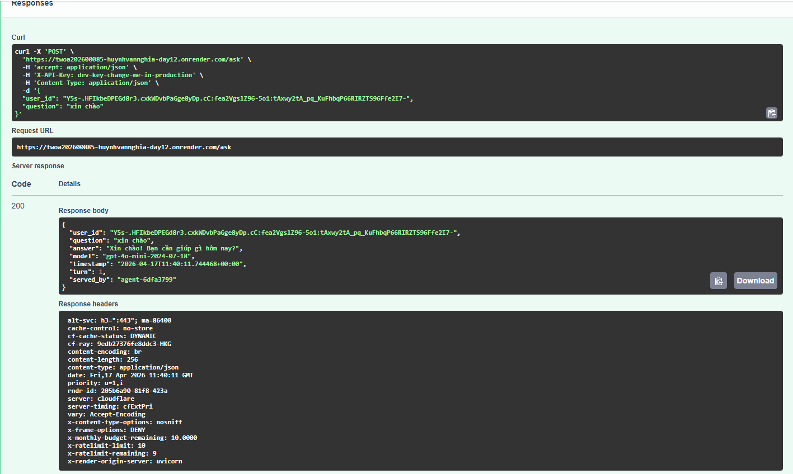
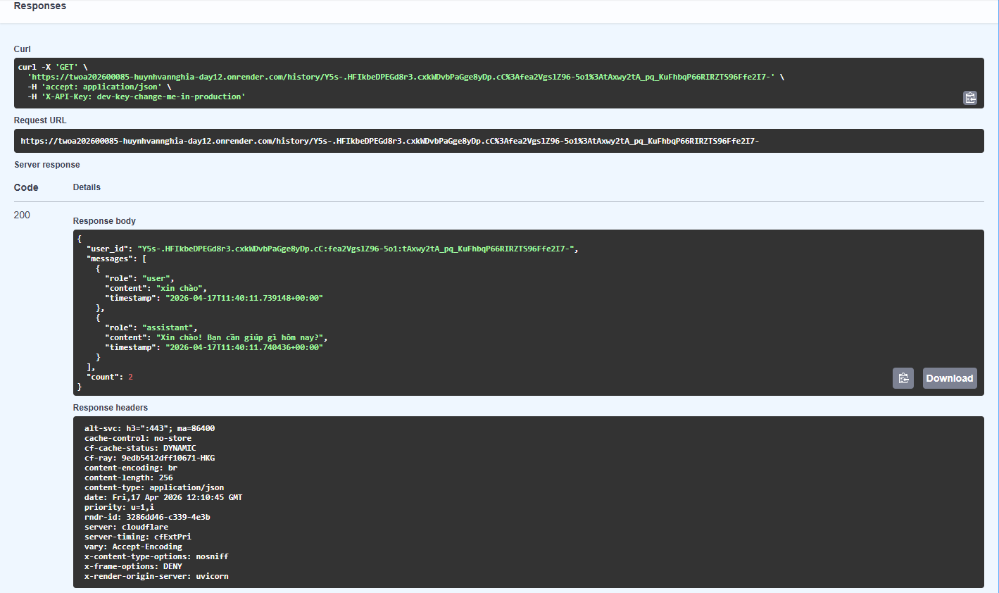
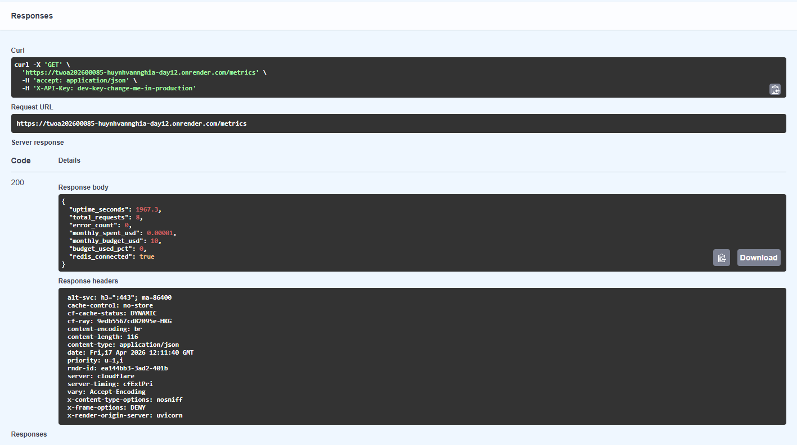
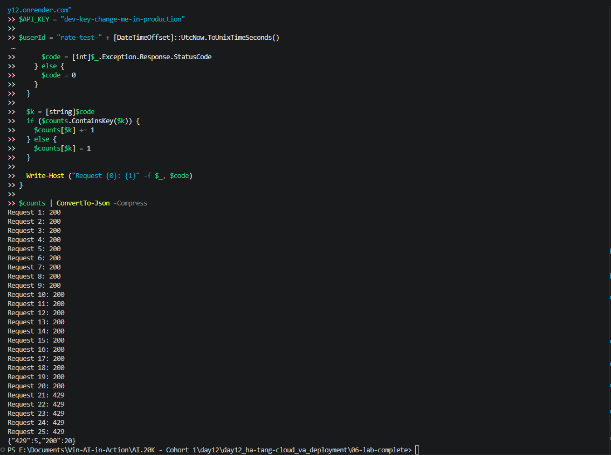

# Tai Lieu API Deployment (Render)

**Student Name:** Huỳnh Văn Nghĩa 
**Student-ID:** 2A202600085  
**Date:** 2026-04-17

## Base URL
https://twoa202600085-huynhvannghia-day12.onrender.com




---

## 1) GET /

- Endpoint: `/`
- Muc dich: Tra thong tin app va danh sach endpoint.
- Request body: Khong co.

Curl:
```bash
curl -i https://twoa202600085-huynhvannghia-day12.onrender.com/
```

Response body:
```json
{
  "app": "AI Agent",
  "version": "1.0.0",
  "environment": "development",
  "instance_id": "agent-9eee7bf1",
  "endpoints": {
    "ask": "POST /ask (requires X-API-Key)",
    "health": "GET /health",
    "ready": "GET /ready",
    "metrics": "GET /metrics (requires X-API-Key)"
  }
}
```

Anh minh chung:


---

## 2) GET /health

- Endpoint: `/health`
- Muc dich: Kiem tra suc khoe service va dependency.
- Request body: Khong co.

Curl:
```bash
curl -i https://twoa202600085-huynhvannghia-day12.onrender.com/health
```

Response body:
```json
{
  "status": "ok",
  "version": "1.0.0",
  "environment": "development",
  "instance_id": "agent-9eee7bf1",
  "checks": {
    "redis": true,
    "redis_required": true,
    "llm": "openai"
  }
}
```

Anh minh chung:


---

## 3) GET /ready

- Endpoint: `/ready`
- Muc dich: Kiem tra service da san sang nhan traffic hay chua.
- Request body: Khong co.

Curl:
```bash
curl -i https://twoa202600085-huynhvannghia-day12.onrender.com/ready
```

Response body:
```json
{
  "ready": true,
  "instance_id": "agent-9eee7bf1"
}
```

Anh minh chung:


---

## 4) POST /ask

- Endpoint: `/ask`
- Muc dich: Gui cau hoi den agent.

### Request body
```json
{
  "user_id": "test-user",
  "question": "Xin chao"
}
```

### Curl test 401 (khong gui API key)
```bash
curl -i -X POST https://twoa202600085-huynhvannghia-day12.onrender.com/ask \
  -H "Content-Type: application/json" \
  -d '{"user_id":"test-user","question":"Xin chao"}'
```

Response body 401 mau:
```json
{
  "detail": "Invalid or missing API key. Include header X-API-Key."
}
```

Anh minh chung:


### Curl test 200 (co API key)
```bash
curl -i -X POST https://twoa202600085-huynhvannghia-day12.onrender.com/ask \
  -H "X-API-Key: YOUR_AGENT_API_KEY" \
  -H "Content-Type: application/json" \
  -d '{"user_id":"test-user","question":"Xin chao, tra loi ngan gon: OK"}'
```

Response body 200 mau:
```json
{
  "user_id": "test-user",
  "question": "Xin chao, tra loi ngan gon: OK",
  "answer": "OK",
  "model": "gpt-4o-mini-2024-07-18",
  "timestamp": "2026-04-17T11:46:43.000000+00:00",
  "turn": 1,
  "served_by": "agent-xxxxxxx"
}
```

Anh minh chung:


---

## 5) GET /history/{user_id}

- Endpoint: `/history/{user_id}`
- Muc dich: Lay lich su hoi thoai cua user.
- Request body: Khong co.

Curl:
```bash
curl -i https://twoa202600085-huynhvannghia-day12.onrender.com/history/test-user \
  -H "X-API-Key: YOUR_AGENT_API_KEY"
```

Response body 200 mau:
```json
{
  "user_id": "test-user",
  "messages": [
    {
      "role": "user",
      "content": "Xin chao",
      "timestamp": "2026-04-17T11:40:00+00:00"
    },
    {
      "role": "assistant",
      "content": "Xin chao!",
      "timestamp": "2026-04-17T11:40:01+00:00"
    }
  ],
  "count": 2
}
```

Anh minh chung:


---

## 6) GET /metrics

- Endpoint: `/metrics`
- Muc dich: Lay metric van hanh va chi phi.
- Request body: Khong co.

Curl:
```bash
curl -i https://twoa202600085-huynhvannghia-day12.onrender.com/metrics \
  -H "X-API-Key: YOUR_AGENT_API_KEY"
```

Response body 200 mau:
```json
{
  "uptime_seconds": 1200.5,
  "total_requests": 123,
  "error_count": 0,
  "monthly_spent_usd": 0.002145,
  "monthly_budget_usd": 10.0,
  "budget_used_pct": 0.02,
  "redis_connected": true
}
```

Anh minh chung:


---

## 7) Test rate limit (tham khao)

- Gioi han: 10 request/phut/user.
- Ket qua lan chay local gan nhat: {"200":20,"429":5}.

Curl minh hoa:
```bash
for i in {1..25}; do
  curl -s -o /dev/null -w "%{http_code}\n" \
    -X POST https://twoa202600085-huynhvannghia-day12.onrender.com/ask \
    -H "X-API-Key: YOUR_AGENT_API_KEY" \
    -H "Content-Type: application/json" \
    -d '{"user_id":"rate-test","question":"spam"}'
done
```

Anh minh chung:


---

## Bien moi truong Render can set

- ENVIRONMENT=production
- OPENAI_API_KEY=<key that>
- AGENT_API_KEY=<key rieng>
- REQUIRE_REDIS=true
- REDIS_INTERNAL_URL=<Internal Redis URL bat dau bang redis:// hoac rediss://>
- RATE_LIMIT_PER_MINUTE=10
- MONTHLY_BUDGET_USD=10.0
- LOG_LEVEL=INFO

## Luu y

1. REDIS_INTERNAL_URL khong duoc la URL HTTPS cua app.
2. Sau khi doi env can redeploy service.
3. Neu /ready bi 503, check logs voi tu khoa redis_unavailable hoac llm_error.

## Repo
https://github.com/NghiaHV2010/2A202600085-HuynhVanNghia-Day12
